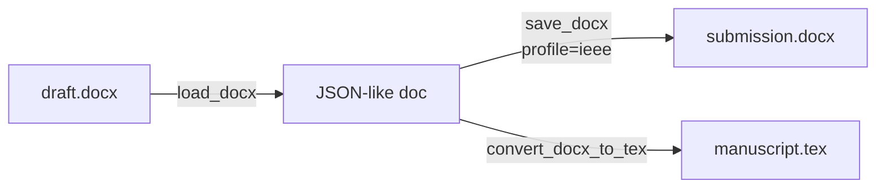

# scitex-msword

<p align="center">
  <a href="https://scitex.ai">
    
  </a>
</p>

<p align="center"><b>MS Word (.docx) reader/writer with journal-style profiles.</b></p>

<p align="center">
  <a href="https://scitex-msword.readthedocs.io/">Full Documentation</a> · <code>uv pip install scitex-msword[all]</code>
</p>

<!-- scitex-badges:start -->
<p align="center">
  <a href="https://pypi.org/project/scitex-msword/"></a>
  <a href="https://pypi.org/project/scitex-msword/"></a>
  <a href="https://github.com/ywatanabe1989/scitex-msword/actions/workflows/test.yml"></a>
  <a href="https://codecov.io/gh/ywatanabe1989/scitex-msword"></a>
  <a href="https://scitex-msword.readthedocs.io/en/latest/"></a>
  <a href="https://www.gnu.org/licenses/agpl-3.0"></a>
</p>
<!-- scitex-badges:end -->

---

## Installation

```bash
pip install scitex-msword
```

## Quick Start

```python
import scitex_msword as sxm

# Word -> intermediate JSON-like document
doc = sxm.load_docx("input.docx", profile="generic")

# JSON-like document -> Word (apply a journal style)
sxm.save_docx(doc, "output.docx", profile="mdpi-ijerph")

# DOCX -> LaTeX (requires the umbrella `scitex` package for the .tex export step)
sxm.convert_docx_to_tex(
    "manuscript.docx", "manuscript.tex",
    profile="resna-2025", image_dir="figures",
)
```

## 1 Interfaces

<details open>
<summary><strong>Python API</strong></summary>

<br>

```python
import scitex_msword as sxm

# Round-trip
doc = sxm.load_docx("paper.docx", profile="generic")
sxm.save_docx(doc, "paper-styled.docx", profile="ieee")

# Helpers
sxm.link_captions_to_images(doc)
sxm.link_captions_to_images_by_proximity(doc)
sxm.normalize_section_headings(doc)
sxm.validate_document(doc)
sxm.create_post_import_hook(doc)

# Register custom profile
sxm.register_profile("my-style", {...})
```

### Built-in profiles

`generic`, `mdpi-ijerph`, `resna-2025`, `iop-double-anonymous`, `ieee`,
`springer`, `elsevier`.

</details>

## Status

Standalone fork of `scitex.msword`. Only runtime dep is `python-docx`. The
umbrella `scitex.msword` import path is preserved via a `sys.modules`-alias
bridge. `convert_docx_to_tex` lazily imports `scitex.tex`, so it works only
when the umbrella package is also installed.

## Architecture

```
scitex_msword/
├── _load.py              ← `load_docx` — DOCX → JSON-like document
├── _save.py              ← `save_docx` — apply profile, write DOCX
├── _convert.py           ← `convert_docx_to_tex` (lazy scitex.tex import)
├── profiles/             ← built-in journal styles
│   ├── generic.py        ← default
│   ├── ieee.py
│   ├── mdpi_ijerph.py
│   ├── resna_2025.py
│   ├── springer.py
│   └── elsevier.py
├── helpers/              ← caption-image linking, heading normalization
└── _registry.py          ← `register_profile` for user styles
```

## Demo



```python
import scitex_msword as sxm

doc = sxm.load_docx("draft.docx", profile="generic")
sxm.save_docx(doc, "submission.docx", profile="ieee")
```

Round-trips DOCX through a JSON-like intermediate, then re-renders with IEEE
column widths, fonts, and heading numbering applied automatically.

## Part of SciTeX

`scitex-msword` is part of [**SciTeX**](https://scitex.ai). Install via
the umbrella with `pip install scitex[msword]` to use as
`scitex.msword` (Python) or `scitex msword ...` (CLI).

>Four Freedoms for Research
>
>0. The freedom to **run** your research anywhere — your machine, your terms.
>1. The freedom to **study** how every step works — from raw data to final manuscript.
>2. The freedom to **redistribute** your workflows, not just your papers.
>3. The freedom to **modify** any module and share improvements with the community.
>
>AGPL-3.0 — because we believe research infrastructure deserves the same freedoms as the software it runs on.

## License

AGPL-3.0-only (see [LICENSE](./LICENSE)).

---

<p align="center">
  <a href="https://scitex.ai" target="_blank"></a>
</p>
